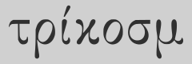

    // work in progress - theorizing //



<!--p align="center">
   
</p-->

# Tricosm

Tricosm is a tool for transforming any [s-expr](https://en.wikipedia.org/wiki/S-expression) input to any s-expr output using its own [metalanguage](https://en.wikipedia.org/wiki/Metalanguage). As s-expr is a format capable of holding any data, Tricosm belongs to a category of data processing tools. Tricosm may be used for a wide range of programming tasks, but its main intentions are to support [theorem proving](https://en.wikipedia.org/wiki/Automated_theorem_proving), [program synthesis](https://en.wikipedia.org/wiki/Program_synthesis), and [metacompiling](https://en.wikipedia.org/wiki/Compiler-compiler).

## 1. project specifics

Tricosm takes an input file, an arbitrary metaprogram, and constructs an output file from the input file using the metaprogram. The metaprogram is actually a set of formulas similar to those in math science with the difference that the Tricosm formulas may transform not only math expressions, but also any kind of s-exprs.

To get an idea of what the Tricosm metaprogram looks like, here's a quick example:

```
(
    LOGOS-RULE
    (
        READ
        (CHAOS-RULE (READ      ) (WRITE (input (hearing voice)))
        (CHAOS-RULE (READ voice) (WRITE (barks meows         )))
    )
    (
        CHAIN
        (CHAOS-RULE (WRITE (input (hearing meows))) (READ (output (being cat))))
        (CHAOS-RULE (WRITE (input (hearing barks))) (READ (output (being dog))))
    )
    (
        WRITE
        (CHAOS-RULE (WRITE                cat dog) (READ living))
        (CHAOS-RULE (WRITE (output (being living))) (READ       ))
    )
)
```

This metaprogram does the following:

- feeding an input file with contents `(input (hearing meows))` yields an output file with contents `(output (being cat))`
- feeding an input file with contents `(input (hearing barks))` yields an output file with contents `(output (being dog))`
- feeding any other input yields an error

## 2. work done so far

A lot of research is invested in conceptualisation of Tricosm, and it is still heavily under construction. During its conceptualisation journey, it has been an agile experimenting project, advancing its theoretical background with each iteration. Curious readers may want to skim over [historical documents directory](https://github.com/tricosm/tricosm/tree/master/history) that theorize about successive iterations (notice that we recycled some names for parts of the latest Tricosm iteration).

The [most recent iteration draft document](tricosm.md) is in preparation phase and it is basically only a syntax sugar over the [latest historical iteration](https://github.com/tricosm/tricosm/blob/master/history/2022-apr-latest-canon.md) representing logos, with addition of two lower level typing systems.

Related to Tricosm, various experiments in Javascript were conducted with term rewriting concepts, achieving some promising results. Please refer to [Rewrite.js](https://github.com/contrast-zone/rewrite.js) project for more information about the latest experiment.

## 3. future plans

We are continuing to actively work on Tricosm, hoping to get closer to actual implementation.

    // work in progress - theorizing //
